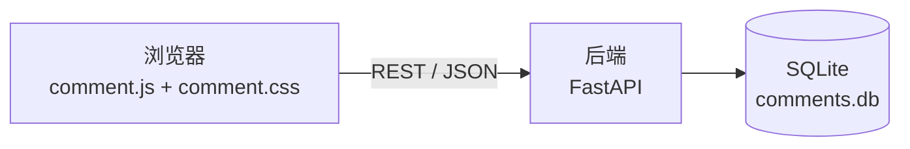

# mkdocs-comment-plugin

一个前后端分离的 MkDocs 评论区插件。前端以 **Material for MkDocs** 的视觉语言渲染，
后端是一个独立的 **FastAPI + SQLite** 服务，负责持久化评论、表情互动与统计数据。



---

## 特性

| 能力 | 说明 |
| --- | --- |
| 📝 Markdown 评论 | 后端渲染并净化，扩展集与站点 `mkdocs.yml` 对齐（代码高亮、折叠块、提示框、表格、脚注、选项卡）；每条评论右上角可一键在渲染结果与 Markdown 原文之间切换 |
| � 逐页开启 | 默认一个页面都没有评论区，页面在自己头部的元数据里写 `comments: true` 才生成（字段名与默认值可配） |
| 😀 表情互动 | 页面级 + 评论级表情，点击切换（再次点击取消），身份由来源 IP 推导；默认集含 👍 ❤️ 😄 🎉 🚀 👀 |
| 📊 统计回显 | 浏览量、评论数、各表情计数实时显示在评论区顶部 |
| 💬 楼中楼回复 | 一级嵌套；回复「回复」时自动带 `@提及` 上下文 |
| 🏷️ 匿名署名 | 不填昵称时显示为「匿名用户」（可配置），头像是主题的通用用户图标；IP 默认对所有访客以淡色等宽小字附在名字旁（`always` / `anonymous` / `never` 三档），既不像以前那样当名字用，也不抢眼 |
| 🎛️ 外观可调 | 强调色、头像样式 / 形状、信息密度、输入框高度、排序、时间格式均可通过配置调整 |
| 🗑️ 自助删除 | 能不能删由**来源地址**决定（昵称不参与），浏览器不再需要保存任何东西；末条回复消失时墓碑会一并腾清 |
| 👥 点赞者名单 | 鼠标悬停（或键盘聚焦）表情胶囊，按顺序列出点过赞的人；名单短于计数时补上「和其他 N 人」 |
| ⌨️ 只能按按钮提交 | 回车不会发送评论（包括昵称框里的回车），因为 Markdown 评论里回车就是换行 |
| 🌗 主题自适应 | 全部颜色取自 Material 的 CSS 变量，自动跟随浅色 / 深色（slate）配色；高亮用的是主题链接悬停色 `--md-accent-fg-color` |
| 💬 状态提示 | 发表 / 删除的回执出现在右下角，与 Material 自带「已复制」气泡的位置、内边距、圆角、阴影、宽度完全一致（仅字号略大，因为文案是整句话） |
| ♻️ 复用 Material | 正文用 `.md-typeset` 渲染、按钮用 `.md-button`、图标用 `.md-icon` + 内置图标源、阴影用 `--md-shadow-z*` |
| 🧩 零前端依赖 | 原生 JS + CSS，不引入任何 CDN 资源 |
| 🛡️ 反垃圾 | 蜜罐字段、写操作与浏览分别按 IP 限流、屏蔽词、长度限制、HTML 白名单净化 |

---

## 目录结构

```text
CommentPlugin/
├── mkdocs_comment_plugin/         # MkDocs 插件（Python 包）
│   ├── plugin.py                  # BasePlugin：注入资源 + 生成运行时配置
│   └── assets/
│       ├── comment.css            # Material 风格样式
│       └── comment.js             # 交互逻辑（原生 JS）
├── backend/                       # 独立后端服务
│   ├── main.py                    # FastAPI 应用与路由
│   ├── database.py                # SQLite 持久化
│   ├── markdown_render.py         # Markdown → 净化 HTML
│   ├── security.py                # IP 解析 / 身份与归属推导 / 令牌 / 限流
│   ├── settings.py                # 环境变量配置
│   ├── schemas.py                 # Pydantic 模型
│   ├── requirements.txt
│   └── .env.example
├── demo/                          # 可直接运行的演示站点
│   ├── mkdocs.yml
│   └── docs/                      # index/guide 开了评论区，no-comments 故意没开
├── scripts/                       # 一键启动 / 测试 / 造数据脚本
│   ├── start-backend.ps1
│   ├── start-demo.ps1
│   ├── smoke_test.py              # 端到端 API 测试
│   ├── test_render.py             # Markdown 渲染与净化测试
│   ├── test_rendering_live.py     # 运行中后端的渲染回归检查
│   ├── seed_demo.py               # 演示数据
│   └── admin.py                   # 数据维护（需管理员令牌）
└── pyproject.toml
```

---

## 快速开始

### 1. 启动后端

```bash
cd backend
python -m pip install -r requirements.txt
uvicorn main:app --host 0.0.0.0 --port 8000
```

首次启动会在 `backend/` 下创建 `comments.db`。接口文档见 <http://127.0.0.1:8000/docs>。

### 2. 安装插件

在项目根目录执行：

```bash
python -m pip install -e .
```

### 3. 配置 `mkdocs.yml`

```yaml
markdown_extensions:
  - meta          # 页面元数据，评论区的开关依赖它

plugins:
  - search
  - comment:
      api_base: http://127.0.0.1:8000/api/v1
```

### 4. 在需要评论区的页面上开启

在页面顶部的元数据里写一行（**默认一个页面都不开**，见下方「哪些页面有评论区」）：

```markdown
---
comments: true
---

# 这一页的内容

页面底部会出现评论区。
```

### 5. 预览

```bash
cd demo
mkdocs serve
```

打开页面并滚动到底部即可看到评论区。

---

## 配置项

| 配置项 | 类型 | 默认值 | 说明 |
| --- | --- | --- | --- |
| `enabled` | bool | `true` | 是否注入评论组件 |
| `api_base` | str | `/api/v1` | 后端 API 根地址，可跨域 |
| `title` | str | `评论` | 评论区标题 |
| `meta_key` | str | `comments` | 页面元数据里用哪个字段表示「本页要评论区」（见下方「哪些页面有评论区」） |
| `meta_default` | bool | `false` | 页面没有写该字段时的默认值；`false` 表示默认不开 |
| `page_selector` | str | 空 | 在**已开启评论区的页面里**换一个挂载容器（CSS 选择器）；留空则渲染在插件插入的宿主元素处。它只能选位置，**不能**决定哪一页有评论区 |
| `reactions` | list | `["👍","❤️","😄","🎉","🚀"]` | 单条评论可用的表情 |
| `page_reactions` | list | 同 `reactions` | 页面级表情；留空则沿用 `reactions` |
| `emoji_picker` | list | 24 个表情 | 表情面板中的候选表情 |
| `show_stats` | bool | `true` | 是否显示统计栏 |
| `show_page_reactions` | bool | `true` | 是否显示页面级表情 |
| `count_views` | bool | `true` | 是否统计浏览量（每次页面加载 +1，后端按 IP 限流防刷） |
| `per_page` | int | `20` | 每页加载的根评论数量 |
| `default_author` | str | `anonymous` | 昵称留空时的处理：`anonymous` 用 `anonymous_name`；`ip` 把访客 IP 当作昵称（旧行为）；其他值则直接作为默认昵称 |
| `anonymous_name` | str | `匿名用户` | 未填写昵称时显示的名字，需与后端 `MKC_ANONYMOUS_NAME` 一致 |
| `require_author` | bool | `false` | 是否强制手动填写昵称 |
| `max_author_length` | int | `60` | 昵称最大长度 |
| `max_content_length` | int | `5000` | 评论最大长度 |
| `allow_delete` | bool | `true` | 是否展示删除按钮（需后端同时开启）；能不能删由服务端按来源地址判定 |
| `labels` | dict | `{}` | 覆盖任意界面文案 |
| `extra_config` | dict | `{}` | 直接合并进前端 `MKCOMMENT_CONFIG` 的兜底入口 |

### 外观与交互

以下选项只影响展示，不影响后端数据。

| 配置项 | 类型 | 默认值 | 说明 |
| --- | --- | --- | --- |
| `accent_color` | str | 空 | 强调色（任意 CSS 颜色），同时覆盖下表中「选中色」与「高亮色」两级；留空则各按主题变量取值。十六进制值会自动推导可读的前景色 |
| `avatar_style` | str | `initial` | `initial` 显示头像（按名字取字，未署名则用主题的用户图标），`none` 完全隐藏头像 |
| `avatar_shape` | str | `circle` | `circle` 圆形，`square` 圆角方形 |
| `density` | str | `comfortable` | `comfortable` 常规间距，`compact` 紧凑（适合长楼） |
| `editor_rows` | int | `4` | 评论输入框默认行数；回复框自动减 1 |
| `sort_order` | str | `newest` | `newest` 新评论在前，`oldest` 按时间正序 |
| `time_style` | str | `relative` | `relative` 显示「3 分钟前」，`absolute` 显示 `2026-09-10 22:35`（悬停提示另一个） |
| `remember_author` | bool | `true` | 是否把昵称存入浏览器 localStorage；共享设备可设为 `false` |
| `reply_quote` | bool | `true` | 回复「回复」时是否自动预填 `> **@昵称**` 引用 |

> `sort_order: oldest` 时列表按时间正序渲染；「加载更多」是向后翻页（取更早的评论），因此后续加载的内容会出现在列表开头。

#### 两级颜色：选中色与高亮色

控件有两种“被点亮”的情形，用的是主题里两个不同的变量，因此看上去也就不一样：

| 层 | 变量 | 主题取值（浅色） | 用在 |
| --- | --- | --- | --- |
| **选中色** | `--mkc-primary` ← `--md-primary-fg-color` | `#4051b5` | 已点赞的表情胶囊（填充）、回复的左侧竖线、默认按钮 |
| **高亮色** | `--mkc-accent` ← `--md-accent-fg-color` | `#526cfe` | 输入框获得焦点时的边框与光晕、昵称框聚焦的边框、表情胶囊悬停的边框与文字、跳转到某条评论时的一闪 |

区分的理由很实际：**选中**是一个已成立的状态，用主题主色看着像“这个东西属于本站”；
**高亮**只是一次暂时的响应，所以取主题里链接悬停时的颜色（`--md-accent-fg-color`）——
读者已经在正文链接上见过它，鼠标一移上去同一个色就会出现，不用额外学。

> 设了 `accent_color` 会同时改写这两级（运维既然指定了自己的强调色，就让它到处一致）。
> 不设时，选中色跟随主题主色、高亮色跟随主题的链接悬停色，各自独立。

#### 状态提示的位置

发表 / 删除成功与失败的短提示（「评论已发布」「评论已删除」等）出现在**视口右下角**，
和 mkdocs-material 自带的「已复制」气泡同一位置、同一尺寸、同一外观：

```text
                                                    ┌──────────────┐
                                                    │  评论已发布   │   ← 我们的提示
                                                    └──────────────┘
                                                    ┌──────────────┐
                                                    │   已复制      │   ← 主题的
                                                    └──────────────┘
                                                      ↑ 距行尾与底边各 0.8rem
```

对齐的不只是位置，而是整个盒子——下边距 `0.8rem`、左右内边距 `0.4rem / 0.6rem`、
圆角 `0.1rem`、`--md-shadow-z3` 阴影、`11.1rem` 最小宽度，全部抄自主题的
`.md-dialog`。两个都是「短暂、自动消失的状态回执」，如果分处两个角落、长得也不一样，
读起来就会像两套不相干的系统。

唯一**故意没有**照抄的是字号：主题的气泡内文是 `0.5rem`（在其 20px 根字号下等于 10px），
它能这么小是因为只有「已复制」三个字；而这里的文案是整句话，
失败提示更是读者最需要看清的一句，所以仍用组件正文的 `0.7rem`——
只是气泡略高一点，不至于要眯着眼看。

细节：

- 用 `inset-inline-end` 而不是 `right`，所以 RTL 站点会像主题那样镜像到另一边。
- 窄屏下宽度以 `min-width: min(11.1rem, calc(100vw - 1.6rem))` 收口：`min-width`
  在层叠里会压过 `max-width`，直接写死最小值会让它在手机上溢出。
- 失败提示是实心红底白字，并且深色配色下**更深**（`#d32f2f` → `#b71c1c`）——
  与页面上文字用的 `--mkc-danger` 方向相反：文字要更亮，而托着白字的底色要更暗。
- 这个气泡是挂在 `<body>` 上的，等于说它**在组件之外**，任何 `--mkc-*` 变量在这里
  都是未定义的；因此它只用根级别的 `--md-*` 变量与字面值。这一条有测试守着，
  因为 `var()` 取不到值时报废的是整条声明且完全无声——最初就是这样丢了圆角和阴影的。

### 查看评论的 Markdown 源码

每条已发表评论的右上角有一个 Markdown 图标按钮，点击在**渲染后的内容**与**Markdown 原文本**之间切换：

````text
◯ 明  小明  127.0.0.1 · 3 分钟前                    [⌗]     ← 点它
                                                     ↑ 源码视图开着时高亮

   渲染视图：试了一下代码块：            ← 默认看到的是渲染结果
   ┌ code ─────────────────────────────┐
   │ print("hello")                    │
   └───────────────────────────────────┘

   源码视图：试了一下代码块：            ← 点一次：原文，缩进与围栏原样保留
   ```python
   print("hello")
   ```
````

设计要点：

- **两种视图一次下发**。`POST /comments` 与 `GET /comments` 同时返回 `content`（原文）与
  `content_html`（渲染结果），切换只是改 `hidden`，不发请求、不重渲染，所以正在填写的回复框
  不会被关掉，滚动位置也不会跳。
- **按钮对每条已发表评论都在**。靠启发式判断「这条像不像 Markdown」需要一个规则，
  而且会让按钮时有时无；固定在同一位置更好学，也才是复制原文的入口。
- **视图选择会跟着重建保留**。点赞、删除等操作会重建列表，此时已展开的源码视图
  （以及同一串里的回复框）不会被合上。
- **墓碑不提供切换**。已删除的评论没有正文可看，按钮也就不出现。
- 文案可用 `labels.showSource` / `labels.showRendered` 改写（分别对应「下一步会看到什么」两种状态）。

> 原文本以 `<pre>` 呈现并自动换行：这是源码视图，必须保留列表、代码块里的空白，
> 长行换行比横向滚动更好读。

### 自定义文案
```yaml
plugins:
  - comment:
      labels:
        title: Comments
        author: Display name
        authorPlaceholder: "Leave empty to show as {name}"
        contentPlaceholder: "Write something… Markdown supported"
        submit: Post comment
        reply: Reply
        more: Load more
        empty: "No comments yet — be the first!"
        showSource: View Markdown source
        showRendered: View rendered content
        justNow: just now
        minuteAgo: "min ago"
        hourAgo: "h ago"
        dayAgo: "d ago"
```

把某个文案设为空字符串即可隐藏对应元素，例如去掉「加载更多」按钮上的文字：

```yaml
plugins:
  - comment:
      labels:
        more: ""
```

`authorPlaceholder` 里的 `{name}` 会被替换成当前生效的匿名昵称（即 `anonymous_name`），
所以把它改名后占位文案不会留在旧名字上。

悬停名单里两处带数字的文案同样支持 `{n}` 占位符，整句替换即可，不必拼接碎片：

```yaml
plugins:
  - comment:
      labels:
        # 名单比计数短时追加，例如「小明 和其他 2 人」
        reactionOthers: "and {n} others"
        # 一个名字都拿不到时显示，例如「共 3 人」
        reactionCount: "{n} people"
```

---

## 哪些页面有评论区

**默认一个页面都没有**。页面要在自己的元数据里声明，插件才会在它底部插入评论区：

```markdown
---
comments: true
---

# 这一页的内容
```

这么设计的原因：

- **加插件不应该改变整站的可见行为**。把组件装到已有的文档站上，
  若几十个页面突然都长出一个评论框，那不是功能，是事故；
  逐页开启让「哪一页有评论」变成一个能被审阅的决定。
- **开关跟内容放在一起**。谁写了这一页，谁就在文件头部写这一行，
  不必去翻 `mkdocs.yml` 或维护一份导航清单。
- **页面键由文件名决定**（`/guide`、`/`），而不是读者碰巧走到的那个 URL，
  所以同一份文档无论从哪条链接进入，评论都落在同一处。

相关配置：

| 配置项 | 作用 |
| --- | --- |
| `meta_key` | 用哪个字段名，默认 `comments`；改成 `discuss` 就写 `discuss: true` |
| `meta_default` | 页面没写这个字段时的默认，默认 `false`；设成 `true` 就是「默认全开、逐页关闭」 |

取值的写法很宽松，下面几种都算开启：`true`、`yes`、`on`、`1`。
除这些之外的写法（包括 `false`、空值，以及拼错的词）一律**不开启**——
页面元数据写错时应该是「少一个评论区」，而不是构建失败或报错。

> ⚠️ 依赖 `meta` 扩展。`mkdocs-material` 已经启用它；如果用的是其他主题，
> 需要在 `markdown_extensions` 里自己加上 `- meta`。
> 后端渲染评论正文时**不会**启用这个扩展（见「Markdown 扩展」一节）。

`page_selector` **只能换位置，不能当开关**：它是给「宿主元素落在正文末尾，但评论区该在别处」
这类情况准备的，指定一个容器让组件渲染进去。它不可能决定哪一页有评论区——
CSS 选择器会在所有命中的页面上生效，所以一旦把它当兜底挂载点，效果等于「整站开启」，
页面头部的元数据看起来就像毫无作用（这正是早期版本的实际行为）。

> 一个页面没有 `comments: true` 时：不注入宿主元素、不渲染组件、**不发任何接口请求**
> （不统计浏览量、不拉评论）。`comment.js` / `comment.css` 仍然会被加载，
> 因为它们是通过 `extra_css` / `extra_javascript` 全站注入的——
> 即时导航需要在下一个页面能挂载。脚本在没有宿主时只是空跑。
> 演示站里的「没有评论区的一页」就是这样一个页面。

---

## 匿名署名、IP 与身份

不填昵称时，评论会署名成「匿名用户」，头像是主题自带的通用用户图标；
**IP 默认对所有人显示**，以淡色等宽小字附在名字之后：

```text
◯ 匿名用户  127.0.0.1  [我] · 刚刚     ← 未署名
◯ 明  小明  127.0.0.1  [我] · 刚刚     ← 已署名，也标出 IP（默认）
```

这么设计的原因：

- **IP 不再当作昵称**。把 `127.0.0.1` 直接当名字既难看，也无法再拿掉；
  现在 IP 是一个独立字段，藏起来就是真的藏起来了（`MKC_SHOW_AUTHOR_IP=never`）。
- **它是匿名评论区里唯一可核对的东西**。昵称是自己声明的，写成什么都行；
  在按地址判身份的前提下，地址反而是读者唯一能对照的线索——
  只给未署名的人看，等于让最需要被人认出的那条留言变成唯一没线索的一条。
  所以默认是 `MKC_SHOW_AUTHOR_IP=always`。
- **IP 是次要信息，因此不抢眼**。它只用主题的代码字体（让人一看就知道这是机器数据，
  而不是名字的一部分）加上最淡的文本色，不加外框、不加底色、比旁边的时间还小——
  需要时能看清，不需要时不会把人拉走。
- **匿名头像用图标而不是字母**。字母头像得为“没有名字”编一个首字，
  而拿占位名去算颜色又会暗示一个它并不具备的固定身份；
  一个通用的用户图标才能直说“未署名”，底色也改取调色板里的中性色，
  因此所有匿名头像长得一模一样。（这是唯一使用实心图的图标，其余都是描边图：
  它坐在一个实心圆盘上，描边会显得发虚。）

> 把地址展示给所有读者，意味着**留言在它们之间互相印证身份**。
> 如果站点的读者实际上并不互相信任（例如面向客户开放），
> 请把 `MKC_SHOW_AUTHOR_IP` 改成 `never`，此时字段根本不会下发到浏览器。

### 身份 = 来源地址

「谁点了这个表情」不再由浏览器自己报，而是**由请求的来源地址推导**：

- 同一个地址就是同一个人。同一台机器再点一次同一个表情，是**取消**而不是加一。
- 因此**同一个人只能占一个位置**，无法像以前那样换个 `visitor_id` 就多出一个身份；
  请求里带着的 `visitor_id` 仍然接受，但**不再起作用**（为兼容旧页面而保留）。
- **一个出口地址背后可能是很多人**。公司、学校、咖啡馆、手机运营商网络的访客共享同一个地址，
  于是他们被视为同一个人：只能给同一个表情点一次，`my_reactions` 里也会显示别人点的状态。
  这是匿名评论区的固有权衡——想要「一人一票」就必须有账号，
  而这里要防止的是「一个人刷出一屏不同的名字」，不是统计选票。
- 旧版本用来记住昵称的 `visitors` 表因此不再需要，新库不再建它；
  已有库里的那张表**不会被删除**（留给你自行判断），只是不再读写。

#### 「我」标签跟着同一条规则

评论作者旁的「我」标签也**由服务端按来源地址判定**，结论写在响应的 `is_mine` 里，
和能不能删除用的是同一个判断：

- 清掉浏览器数据、换个浏览器、换台设备，只要还在同一个出口，你的评论依旧标着「我」——
  标签说的是「这条是你写的」，不是「这个浏览器还记得你写过」。
- 反过来，从别人手里接过浏览器、或只是换了 Wi-Fi，同一批评论就不再是你的了。
- 关了 `allow_delete` 之后标签仍然在：**删不了不等于不是你写的**，
  所以它才与 `can_delete` 分开成两个字段。
- 评论被删除后，昵称与「我」都会保留（正文已经清空），因为你写的还是你写的，
  而且同一串里活下来的回复会继续标「我」，只剩根评论没标签反而像坏了。

> 这是「一个地址就是一个人」的直接后果，和点赞互相顶掉是同一个原因。
> 想要在共享出口下区分到人，只能引入登录。

### 两端需要保持一致

```yaml
# mkdocs.yml
plugins:
  - comment:
      default_author: anonymous     # 或 ip，或一个固定昵称
      anonymous_name: 匿名用户      # 需与后端一致
```

```dotenv
# backend/.env
MKC_DEFAULT_AUTHOR=anonymous
MKC_ANONYMOUS_NAME=匿名用户
MKC_SHOW_AUTHOR_IP=always           # always（默认） | anonymous | never
```

组件会以**服务端**的值为准（`/config` 里的 `anonymous_name`），
所以只改后端也能让占位文案和头像跟上；mkdocs.yml 里的那份用于「还没拿到服务端配置」时的回退。

升级说明：启动时后端会把**以 IP 作为昵称**的历史记录改写成匿名昵称
（地址本身仍留在 `client_ip`，因此不会丢信息）。如果把 `MKC_DEFAULT_AUTHOR` 设为 `ip`，
说明你确实想让地址当名字，这一步会自动跳过。

---

## 后端配置（环境变量）

复制 `backend/.env.example` 为 `backend/.env` 后按需修改。

| 变量 | 默认值 | 说明 |
| --- | --- | --- |
| `MKC_ROOT_PATH` | 空 | 反向代理子路径，例如 `/comments`，仅影响生成的接口文档地址 |
| `MKC_DB_PATH` | `comments.db` | SQLite 文件路径；相对路径以 `backend/` 为基准 |
| `MKC_CORS_ORIGINS` | `*` | 允许的来源，逗号分隔；**生产环境请收紧** |
| `MKC_MAX_CONTENT_LENGTH` | `5000` | 评论最大长度 |
| `MKC_MAX_AUTHOR_LENGTH` | `60` | 昵称最大长度 |
| `MKC_RATE_LIMIT_REQUESTS` / `MKC_RATE_LIMIT_WINDOW` | `30` / `60` | 每 IP 每窗口内写操作上限 |
| `MKC_VIEW_RATE_LIMIT_REQUESTS` / `MKC_VIEW_RATE_LIMIT_WINDOW` | `60` / `60` | 每 IP 每窗口内浏览量上限 |
| `MKC_ALLOW_DELETE` | `1` | 是否允许评论者自助删除（按来源地址判定；设为 `0` 则只剩管理员能删） |
| `MKC_ADMIN_TOKEN` | 空 | 管理员令牌，用于硬删除；留空表示禁用 |
| `MKC_BLOCKED_WORDS` | 空 | 屏蔽词，逗号分隔 |
| `MKC_TRUST_PROXY_HEADERS` | `0` | Nginx / Caddy / Cloudflare 前置时设为 `1`，才会信任 `X-Forwarded-For` |
| `MKC_DEFAULT_AUTHOR` | `anonymous` | 昵称留空时的处理：`anonymous` 用 `MKC_ANONYMOUS_NAME`；`ip` 把 IP 当昵称（旧行为）；其他值则作为默认昵称 |
| `MKC_ANONYMOUS_NAME` | `匿名用户` | 未填写昵称时显示的名字 |
| `MKC_SHOW_AUTHOR_IP` | `always` | 谁的名字旁边标出 IP：`always`（所有人，默认）\| `anonymous`（仅未署名）\| `never`（都不显示，也不下发字段） |
| `MKC_COMMENT_REACTIONS` | `👍,❤️,😄,🎉,🚀,👀` | 允许的评论表情白名单 |
| `MKC_PAGE_REACTIONS` | `👍,❤️,😄,🎉,🚀,👀` | 允许的页面表情白名单 |
| `MKC_EMOJI_PICKER` | 24 个表情 | 表情面板候选 |
| `MKC_MARKDOWN_EXTENSIONS` | 对齐 `demo/mkdocs.yml` | Markdown 扩展集，**需与站点 `markdown_extensions` 一致**，详见下一节 |

### Markdown 扩展（`MKC_MARKDOWN_EXTENSIONS`）

评论预览必须与它所在的页面用同一套扩展渲染，否则同一段文本会出现两种样子。
所以后端把扩展集做成配置项，而不是写死的清单：

```dotenv
# 只需要扩展名：逗号分隔
MKC_MARKDOWN_EXTENSIONS=admonition,tables,toc,pymdownx.superfences

# 扩展需要选项：JSON 数组，就是 mkdocs.yml 那一块的直译
MKC_MARKDOWN_EXTENSIONS=["admonition", "tables", "toc", "pymdownx.superfences", {"pymdownx.tabbed": {"alternate_style": true}}]
```

留空时使用内置默认值，它已经与本仓库的 `demo/mkdocs.yml` 逐项对齐；
`pytest scripts/test_markdown_parity.py` 会守着这件事 —— 两边任一改动而另一边没跟上，测试就会失败。

两点需要注意：

* **不要启用 `nl2br`**。它会给每个换行插入 `<br>`，而 `mkdocs.yml` 默认没有它，
  结果是每条多行评论的预览都与发表后的样子不同。
* `toc` 默认**不带** `permalink`。这是与 `mkdocs.yml` 唯一有意的差异：评论标题不是页面章节，
  给它加 `¶` 永久链接会让人复制到指向评论内部的锚点。需要完全一致时写成
  `{"toc": {"permalink": true}}`。

改完扩展集后重新发表一条评论，或在预览里试一下即可看到效果。

### 关于表达式

`pymdownx.*` 来自 `pymdown-extensions`，它本身就是 mkdocs-material 的依赖，
所以后端多这一个包就能和站点同源；它已写在 `backend/requirements.txt` 里。

---

## REST API

所有接口均以 `/api/v1` 为前缀。

| 方法 | 路径 | 说明 |
| --- | --- | --- |
| `GET` | `/health` | 健康检查 |
| `GET` | `/config` | 服务端表情集合、长度限制与匿名昵称（供组件对齐文案） |
| `GET` | `/whoami` | 返回调用方 IP 与建议昵称（匿名模式下为空，不预填） |
| `GET` | `/comments?page=&limit=&offset=` | 分页拉取根评论及其回复、页面统计 |
| `POST` | `/comments` | 发表评论 / 回复 |
| `DELETE` | `/comments/{id}` | 删除评论。能否删由**来源地址**决定（一次性令牌与管理员令牌也接受）；响应中的 `mode` 说明走的是哪种删除，`removed` 列出真正被移除的全部 id |
| `POST` | `/reactions` | 切换页面 / 评论表情 |
| `POST` | `/views` | 浏览量 +1（每次调用都计数，超限返回 `429`） |
| `GET` | `/stats?page=` | 页面统计 |
| `POST` | `/preview` | Markdown 预览渲染 |

> `/comments`、`/stats`、`/whoami` 仍然接受 `visitor_id` 参数（而 `POST /comments`、
> `POST /reactions` 也仍然接受请求体里的 `visitor_id`），但**它已不再决定身份**：> 谁点的、谁能删，一律由请求的来源地址推导。保留它只为让还在发这个字段的
> 旧页面继续通过校验，不会报错。

### 示例

```bash
# 发表评论
curl -X POST http://127.0.0.1:8000/api/v1/comments \
  -H "Content-Type: application/json" \
  -d '{"page":"/guide","author":"小明","content":"**支持 Markdown** 👍"}'

# 拉取评论
curl "http://127.0.0.1:8000/api/v1/comments?page=/guide"

# 点赞（身份取自来源地址，因此这一条会在同一个地址上被下一次调用取消）
curl -X POST http://127.0.0.1:8000/api/v1/reactions \
  -H "Content-Type: application/json" \
  -d '{"target_type":"page","target_id":"/guide","emoji":"👍"}'
```

`POST /comments` 返回体：

```json
{
  "comment": {
    "id": "0f2c…",
    "page": "/guide",
    "parent_id": null,
    "thread_id": "0f2c…",
    "reply_to": null,
    "author": "小明",
    "content": "**支持 Markdown** 👍",
    "content_html": "<p><strong>支持 Markdown</strong> 👍</p>",
    "created_at": "2026-09-10T04:12:33+00:00",
    "deleted": false,
    "can_delete": true,
    "is_mine": true,
    "reactions": {},
    "my_reactions": []
  },
  "delete_token": "…"
}
```

---

## 页面标识（`page`）
前端默认使用 `location.pathname` 作为页面键，并做如下归一化：

- 去掉 `index.html` 后缀
- 去掉末尾多余的 `/`
- 对 URL 做一次 `decodeURI`

因此 `/guide/`、`/guide`、`/guide/index.html` 会被视为同一页面。
如需完全自定义，可通过 `extra_config` 覆盖：

```yaml
plugins:
  - comment:
      extra_config:
        page: "/my-custom-key"
```

---

## 部署

### 同源部署（推荐）

让反向代理把 `/api` 转发到后端，这样前端只需使用相对路径，且不会触发 CORS。

```nginx
server {
    listen 80;
    server_name docs.example.com;
    root /var/www/site;

    location /api/ {
        proxy_pass http://127.0.0.1:8000;
        proxy_set_header Host $host;
        proxy_set_header X-Forwarded-For $proxy_add_x_forwarded_for;
    }
}
```

```yaml
# mkdocs.yml
plugins:
  - comment:
      api_base: /api/v1
```

后端相应设置：

```env
MKC_CORS_ORIGINS=https://docs.example.com
MKC_TRUST_PROXY_HEADERS=1
```

> 注意：`site_url` 会影响插件写入的静态资源路径。若站点部署在子路径
> （如 `https://example.com/docs/`），请在 `mkdocs.yml` 中正确设置 `site_url`，
> 插件会据此生成 `/docs/assets/comment-plugin/...`。

### Docker

```bash
docker build -t mkdocs-comment-backend ./backend
docker run -d -p 8000:8000 -v $(pwd)/data:/data \
  -e MKC_DB_PATH=/data/comments.db \
  -e MKC_CORS_ORIGINS=https://docs.example.com \
  mkdocs-comment-backend
```

或使用 `docker compose up -d`。

自带的 `docker-compose.yml` 已经采用安全默认值：端口只映射到 `127.0.0.1`，
`MKC_TRUST_PROXY_HEADERS` 为 `0`（与“不能直连”的假定一致），
管理员令牌注释保留待填。改动这两项时请对照下面的检查清单。

### 生产环境检查清单

按影响面排序，前几项不处理会直接出问题。

**1. 收紧 CORS**

默认 `MKC_CORS_ORIGINS=*` 允许任意站点调用你的接口。同源部署其实用不到 CORS，
但仍然要设成明文的站点域名。启动时若仍是 `*`，日志会打印一条 warning。

```env
MKC_CORS_ORIGINS=https://docs.example.com
```

`MKC_CORS_ALLOW_CREDENTIALS` 保持 `0`。组件不使用 Cookie，也不发送任何凭据，
因此不需要放开它；而浏览器本身也拒绝 `*` + 凭据的组合。

**2. 配置管理员令牌**

留空即禁用管理员能力（硬删除会返回 `403`），管理脚本也无法工作：

```bash
python -c "import secrets; print(secrets.token_urlsafe(32))"
```

```env
MKC_ADMIN_TOKEN=上一步生成的随机串
```

它只存在于后端环境变量里，**不会**下发到前端（`config.js` 只包含界面配置）。

**3. 把监听地址限在回环上**

后端只应该被同机的反向代理访问。监听地址是**启动参数**（没有环境变量）：

```bash
python -m uvicorn main:app --host 127.0.0.1 --port 8000
```

配合防火墙不应公网开放该端口。若后端能被直连，下面的 `MKC_TRUST_PROXY_HEADERS` 就不能开；
反过来说，如果它已经是公网可达状态，请先把它收回来，而不是用配置去弥补。

**4. 确认 `MKC_TRUST_PROXY_HEADERS` 与实际拓扑一致**

这一项两个方向都会出问题，值得单独说清：

| 拓扑 | 设置 | 不这样做会怎样 |
| --- | --- | --- |
| 后端**只在**反向代理后面可达 | `1` | 所有请求的 IP 都是代理的地址：① 所有访客共用同一个 `ip-…` 访客身份，点赞会互相顶掉；② 限流按代理 IP 计，`30 次/60 秒` 变成**全站共享**的预算，正常流量就会开始收到 `429` |
| 后端**能被直连**（未限制端口） | `0` | 任何人都能自己伪造 `X-Forwarded-For`，从而绕过限流、伪造访客身份 |

配套的代理配置（Nginx 示例已包含）：

```nginx
proxy_set_header X-Forwarded-For $proxy_add_x_forwarded_for;
```

**5. 补上 `site_url`**

插件据此生成静态资源路径。子路径部署（如 `https://example.com/docs/`）而没设 `site_url` 时，
`extra_css` / `extra_javascript` 会指向 `/assets/comment-plugin/...` 而不是
`/docs/assets/comment-plugin/...`，页面上的评论区会直接不出现。

**6. 静态资源缓存**

`comment.js` / `comment.css` 的**文件名不含哈希**，内容变了 URL 也不变。
升级插件后需要让 CDN 与浏览器失效，否则访客会继续跑旧版脚本：

- 给 `/assets/comment-plugin/` 设较短的 `Cache-Control`（如 `max-age=3600`），其余资源照常长缓存；
- 或在部署流程里主动 purge 这个前缀。

开发时同理——`mkdocs serve` 会缓存这些资源，改完必须重启它；而且它**只监视 `docs/` 与
`mkdocs.yml`**，改插件目录下的 `comment.js` / `comment.css` 不会触发重建。

**7. 想清楚 IP 展示给谁看**

IP 默认（`MKC_SHOW_AUTHOR_IP=always`）对**所有读者**显示，包括已经填了昵称的人。
这是默认值，因为地址是匿名评论区里唯一可以被别人核对的东西：昵称可以随便写，
而读者的彼此辨认只能靠它。但如果你的读者之间并不互相信任（面向客户、对外招聘、
含敏感话题的内部站），把地址亮给所有人是有代价的：

```env
MKC_SHOW_AUTHOR_IP=anonymous   # 只标未署名的评论
MKC_SHOW_AUTHOR_IP=never       # 完全不显示，字段也不会下发给浏览器
```

这两档都不需要改数据：地址始终写在 `client_ip` 里，切换的只是是否下发。
反过来说，切换**不会**抹掉已经收集到的地址，真正的删除要走上面的
「删除数据（隐私请求）」。

### 推荐配置

```env
# --- 监听与存储 ------------------------------------------------------
# 监听地址不是环境变量，而是启动参数；见下面的启动命令。
MKC_DB_PATH=/data/comments.db

# --- 安全 ------------------------------------------------------------
MKC_CORS_ORIGINS=https://docs.example.com
MKC_CORS_ALLOW_CREDENTIALS=0
MKC_ADMIN_TOKEN=<32 字节随机串>
MKC_TRUST_PROXY_HEADERS=1
MKC_PROXY_HEADER=X-Forwarded-For

# --- 限制 ------------------------------------------------------------
# 同一出口（公司 NAT、校园网）后的读者共用这个配额，别调太小。
MKC_RATE_LIMIT_REQUESTS=30
MKC_RATE_LIMIT_WINDOW=60
MKC_MAX_CONTENT_LENGTH=5000
MKC_MAX_AUTHOR_LENGTH=60
MKC_ALLOW_DELETE=1

# --- 署名与隐私 ------------------------------------------------------
MKC_DEFAULT_AUTHOR=anonymous
MKC_ANONYMOUS_NAME=匿名用户
MKC_SHOW_AUTHOR_IP=always      # 想只给未署名的人看就设 anonymous，想完全不显示就设 never

# --- 渲染 ------------------------------------------------------------
# 必须与站点 mkdocs.yml 的 markdown_extensions 一致；见「Markdown 扩展」一节。
```

对应的 `mkdocs.yml`（注意 `api_base` 用相对路径，走同源）：

```yaml
site_url: https://docs.example.com/

markdown_extensions:
  - meta            # 评论区的逐页开关依赖它

plugins:
  - comment:
      api_base: /api/v1
      default_author: anonymous
      anonymous_name: 匿名用户
      per_page: 20
      count_views: true
```

启动命令（服务监听地址由这里决定，**没有**对应的环境变量）：

```bash
# 本机或同一台机器上有反向代理：只监听回环地址，外部无法直连
python -m uvicorn main:app --app-dir backend --host 127.0.0.1 --port 8000

# 容器内：必须监听 0.0.0.0，否则端口映射不生效（Dockerfile 已如此）
uvicorn main:app --host 0.0.0.0 --port 8000
```

> 曾经有过 `MKC_HOST` / `MKC_PORT` 两个变量，但它们从未真正影响绑定
> （进程是用 `uvicorn` 命令行启动的），因此已经移除——
> 看起来能限住端口、实际没限住，比没有这个选项更危险。

### 运维

**备份**

SQLite 开了 WAL，数据可能还在 `-wal` 文件里没有 checkpoint。因此**不要直接 `cp comments.db`**
——拿到的是撕裂的快照。用 SQLite 自己的备份命令：

```bash
sqlite3 /data/comments.db ".backup '/backup/comments-$(date +%F).db'"
# 或（不依赖 sqlite3 客户端）
python -c "import sqlite3;sqlite3.connect('/data/comments.db').execute(\"VACUUM INTO '/backup/today.db'\")"
```

要接着备份就一起带上 `-wal` / `-shm`；`.backup` 与 `VACUUM INTO` 出来的单文件则是自洽的。

**升级**

启动时会自动完成结构迁移（补列、改正以 IP 为昵称的历史记录），全部幂等，可以反复启动。
流程仍是「先备份，再换版本，然后看启动日志」：

```bash
sqlite3 /data/comments.db ".backup '/backup/pre-upgrade.db'"
docker compose up -d --build
docker compose logs --tail 50 comments-backend
```

日志里会说明做了什么，例如：

```text
评论服务已启动，数据库：/data/comments.db
已将 5 条以 IP 为昵称的历史记录改为「匿名用户」
```

**删除数据（隐私请求）**

IP 属于个人数据，而它默认是**展示给所有读者**的，因此需要能响应删除请求：

```bash
export MKC_ADMIN_TOKEN=<token>

python scripts/admin.py list /guide                 # 找到目标
python scripts/admin.py purge-body "关键词" / /guide  # 按内容片段清理
python scripts/admin.py purge /guide                # 清空某页
python scripts/admin.py purge-deleted /guide        # 清掉墓碑占位记录
python scripts/admin.py purge-reactions /guide      # 重置某页的表情互动
```

按 IP 精确定位需要直接查库（评论与表情都存了 `client_ip`）：

```sql
SELECT id, page, author, created_at FROM comments WHERE client_ip = '203.0.113.7';
DELETE FROM comments WHERE client_ip = '203.0.113.7';
DELETE FROM reactions WHERE client_ip = '203.0.113.7';
```

**健康检查**

`GET /api/v1/health` 返回 `{"status":"ok","version":"…"}`，Dockerfile 已用它作为
`HEALTHCHECK`，可直接接给探针。

**日志**

应用日志只记录评论的 `id`、作者与页面（`新评论 <id> (<作者>) 于 <页面>`），
**不记录正文**，所以用户内容不会进日志文件。反向代理的访问日志会记录路径，
其中包含页面键（`/api/v1/comments?page=/guide`），但不含评论内容。

### 已知边界

写清楚这些，是为了让扩容时有明确的方向，而不是盲目加进程。

- **限流在内存里，按进程计**。多开 `--workers` 会让每个进程各有一份计数器，
  实际额度成倍放大；进程重启后计数归零。要严格限流应换 Redis 之类的共享后端。
- **SQLite 是单写者**。并发写会串行化（有 30s 超时保护），对文档站评论区够用；
  写入量大时应迁移到 Postgres。
- **只有一个 uvicorn 进程**。Dockerfile 刻意不加 `--workers`：上面的两条限制决定了
  多进程在这个架构下只会带来不一致，而不是吞吐。评论接口本身是 IO 轻、写入串行的工作负载。
- **没有认证**。任何人都能发表评论和点赞，这是匿名评论区的固有属性。
  防守手段是蜜罐字段、按 IP 限流、长度限制、屏蔽词与 HTML 白名单净化；
  删除自己评论的凭据是**来源地址**（外加一次性的令牌作备用）。若要完全杜绝垃圾内容，
  需自行在反向代理层加验证码或 WAF。
- **不要用 `--reload`**。它是开发用热重载，会常驻文件监视并可能双开进程。
- **一个出口地址后面的人会被当成同一个人**。这是按地址判身份的直接后果：
  公司、校园网、咖啡馆的访客共用身份，同一个表情只能点一次、会互相顶掉，
  而且**可以互相删除评论**。要区分同一出口下的人，只有引入登录。
  把 `MKC_ALLOW_DELETE` 设为 `0` 可以整个关掉自助删除（只剩管理员），
  这是唯一不引入登录就能收紧这一点的开关。

---

## 安全说明

代码本身做了什么（部署侧要做什么见上面的「生产环境检查清单」）：

- **Markdown 是服务端渲染并净化的**。`bleach` 三重白名单限制标签、属性与协议，
  再叠加长度限制与屏蔽词，因此即使第三方页面嵌入了这个组件，也不存在存储型 XSS。
  渲染在服务端而不是浏览器，就是为了让所有客户端拿到同一份已净化的 HTML。
- **输出统一 HTML 转义**。昵称、页面键等都经过转义，不信任任何写入过的字符串。
- **外链主动加固**。`http(s)` 链接一律追加 `rel="nofollow noopener noreferrer"`
  与 `target="_blank"`。
- **删除权按地址判定**，不由昵称或客户端自报的状态决定；一次性令牌仍然接受，
  但库里只存它的 SHA-256，比较用 `hmac.compare_digest`，
  因此拿到数据库也拿不到可用的令牌。代价见下面的「已知边界」。
- **管理员令牌只存后端**。它不参与任何下发到前端的配置，泄漏面仅限服务端环境变量。
- **IP 读取是可选信任的**。`X-Forwarded-For` 只在 `MKC_TRUST_PROXY_HEADERS=1` 时生效，
  否则任何人都能自选 IP，也就自选了限流额度、访客身份**和删除权**。
- **蜜罐字段**。请求体里的 `website` 字段有值即拒绝（`400`），能挡掉相当一部分通用爬虫。
- **限流只作用于写操作**（发表、点赞、浏览），读取接口不限流，因此不会误伤正常浏览。
- **IP 是展示策略，不是安全边界**。默认对所有读者显示（见「生产环境检查清单」第 7 项），
  因为按地址判身份之后，地址是读者唯一能核对的线索。把它当成防滥用手段是不成立的：
  共享出口会让很多人共用一个地址，而换一个网络就能换一个身份。

> 请注意这不是一个带账号体系的产品：接口没有认证，任何人都能匿名发表与点赞。
> 上面的措施用于「限制滥用」，不用于「识别用户」——需要后者请自行接入登录态。

### 删除自己的评论

**能不能删，由来源地址决定**，昵称不参与这个判断：

| 判定 | 说明 |
| --- | --- |
| 来源地址 == 评论的 `client_ip` | 可以删（与「谁点的赞算我的」同一条规则） |
| 持有发布时下发的一次性令牌 | 也可以删——换到别的网络后地址不再能为你作证 |
| 管理员令牌（`X-Admin-Token`） | 硬删除任意评论及其整串回复 |

这么设计是因为身份已经是地址：读者清掉浏览器数据、换个浏览器、换台设备，
只要还在同一个出口，他就还是同一个人，不应该因此删不掉自己的评论。
昵称则绝对不能参与——它是自己写的，谁都能取同一个，
一个靠名字放行的删除权等于把它送给任何读过页面的人。

服务端会把结论直接写在响应的 `can_delete` 字段里，前端据此显示删除按钮，
不需要浏览器自己判断（它也判断不了：`MKC_SHOW_AUTHOR_IP=never` 时地址根本不下发）。
评论旁边的「我」标签是同一个判断，另写在一个 `is_mine` 字段里（见上面的「「我」标签跟着同一条规则」）——
把两件事写在两个字段，是因为关掉 `allow_delete` 只会改变能不能删，不会改变是谁写的。

> 同一出口下的读者因此可以互相删除评论——这是「一个地址就是一个人」的直接后果，
> 和点赞互相顶掉是同一个原因。要区分同一出口下的人，只有引入登录。

删除后，后端会看下"有没有人回复过它"，分两种处理：

| 情况 | 处理 | 结果 |
| --- | --- | --- |
| 无人回复 | **硬删除** | 行彻底移除（含它的表情），列表里不留痕迹 |
| 有人回复 | **软删除** | 保留行作为墓碑：正文清空、显示"该评论已被删除" |

取舍的理由：

- 没人引用它时留一个占位只是噪声，直接删掉更干净。
- 有回复时必须留下墓碑，否则回复会变成无主孤儿。
- 墓碑**保留作者名**，因为逐层回复里引用的 `@提及` 指向它，丢掉会让回复失去上下文。
- 墓碑**保留已收集的点赞**。内容确实不见了，但附着在这条线索上的互动没必要一并消失。
- 墓碑**不下发 IP**（也不下发正文原文）。作者名有必须留下的理由，地址没有：
  它不参与回复的上下文，而提出删除的人并没有同意继续被地址认出来。

墓碑只是临时结构，回复走完就没了：**删掉一幅墓碑下的最后一条回复时，墓碑本身会一并腾清**。
否则删掉一层、再删二层之后，页面上会永远留一个空的「该评论已被删除」——
这不符合任何人的直觉。如果墓碑下还有别的回复（或它本身还没被删），它就会继续保留。

因此有一条不变式：**墓碑一定还有回复**。服务端在启动时会扫一遍库来保证它成立
（日志里会写「已清理 N 条无回复的已删除占位」）——不是为了让正常删除更干净
（正常删除本来就不会留下这种行），而是因为库还可能从别处变成那个样子：
早于「腾清墓碑」那个版本写入的旧数据、从旧备份恢复的库、被手工改过的行。
启动时顺手清掉，比让读者永远看着一个「该评论已被删除」的空位要好。

`DELETE /comments/{id}` 的响应里有：

| 字段 | 含义 |
| --- | --- |
| `mode` | `soft`（保留墓碑）或 `hard`（行已移除） |
| `removed` | 本次真正被移除的全部 id；硬删除可能一次带走多个（被腾清的墓碑） |

前端据此把对应条目从列表里移除。

---

## 开发

```bash
# 安装插件（可编辑模式）+ 演示依赖
python -m pip install -e ".[dev]"

# 后端热重载（仅开发用；生产不要带 --reload）
cd backend && uvicorn main:app --reload --port 8000

# 前端调试：改完 assets 后重新构建即可生效
cd demo && mkdocs build
```

两个开发时容易踩的点：

- **改完 `comment.js` / `comment.css` 必须重启 `mkdocs serve`**。它从内存提供资源并会缓存，
  刷新浏览器拿不到新版本（详见「静态资源缓存」）。
- **后端要报自己的库，而不是进程当前目录的库**。`MKC_DB_PATH` 的相对路径以 `backend/`
  为基准，因此从仓库根用 `--app-dir backend` 启动也只会用到 `backend/comments.db`；
  启动日志里的「数据库：」会打印绝对路径，怀疑“怎么没数据”时先看一眼它。

插件的 `on_post_build` 会把 `comment.css` / `comment.js` 复制到
`site/assets/comment-plugin/`，并根据你的 `mkdocs.yml` 生成同样目录下的 `config.js`。

### 验证与测试

```bash
# 渲染与净化测试（Markdown 特性、与 mkdocs.yml 对齐、XSS 白名单、转义层数）
python scripts/test_render.py

# 与 demo/mkdocs.yml 的扩展集对齐检查（任一改动而另一边没跟上就会失败）
python scripts/test_markdown_parity.py

# 数据层测试（旧库升级、按访客恢复点赞者姓名、匿名昵称归并、墓碑腾清与启动清扫）
python scripts/test_database.py

# 署名策略测试（匿名名字、IP 可见性三档、非法取值）
python scripts/test_identity.py

# 安全工具测试（XFF 信任开关、访客 ID 推导、令牌比较、限流内存边界）
python scripts/test_security.py

# 配置契约测试（枚举校验、mkdocs.yml -> config.js -> 前端 DEFAULTS 的三跳映射、
# 配色两级、提示气泡与主题 `.md-dialog` 的位置对照）
python scripts/test_config.py

# 图标出处测试（内联的图标与已安装主题是否一致、界面是否误用 emoji、匿名头像）
python scripts/test_icons.py

# 端到端冒烟测试（渲染、表情、统计、限流、权限等 75+ 项断言）
python scripts/smoke_test.py

# 针对运行中后端的渲染回归检查
python scripts/test_rendering_live.py

# 若服务端配置了 MKC_ADMIN_TOKEN，测试结束后会自动清理测试数据
MKC_ADMIN_TOKEN=your-token python scripts/smoke_test.py
```

冒烟测试只操作 `/__smoke_test__` 这个专用页面，不会污染真实数据。
除 `smoke_test.py` 与 `test_rendering_live.py` 外的套件都同时兼容 pytest：

```bash
pytest scripts/test_render.py scripts/test_markdown_parity.py scripts/test_database.py scripts/test_identity.py scripts/test_security.py -q
```

> `test_database.py` 在临时目录里建库，可以构造“升级前”的旧表结构，
> 因此能真正验证迁移与回填，而不只是相信它们。

### 生成演示数据

```bash
# 向指定页面写入 N 条演示评论（默认 25 条，写入 /）
python scripts/seed_demo.py 25

# 指定后端地址与页面
python scripts/seed_demo.py 14 http://127.0.0.1:8000 /guide
```

### 数据维护

需要服务端配置 `MKC_ADMIN_TOKEN`。

```bash
export MKC_ADMIN_TOKEN=your-token

python scripts/admin.py list /guide      # 列出某页评论
python scripts/admin.py purge /guide     # 清空某页所有评论
python scripts/admin.py purge-body "测试" / /guide   # 按内容片段清理
python scripts/admin.py purge-deleted /guide         # 清掉已软删除的占位记录
python scripts/admin.py purge-reactions /guide       # 重置某页的全部表情互动
```

> 软删除会保留行结构并清空正文，因此 `purge-body` 无法按内容匹配到它；
> 清理这类"该评论已被删除"的占位记录请用 `purge-deleted`。
> **它只清掉已经没挂着回复的那些**（服务端启动时也会做同样的事），
> 还挂着回复的墓碑会保留并打印出来——它们正托着下面的回复。
> `purge-reactions` 适合重置演示状态，或清除早于「记录点赞者昵称」之前写入的历史表情（那些行没有昵称，永远不会出现在悬停名单里）。

### 一键脚本（PowerShell）

```powershell
.\scripts\start-backend.ps1          # 启动后端（默认 8000）
.\scripts\start-demo.ps1             # 安装插件并启动演示站（默认 8001）
```

### 修改前端资源后

`mkdocs serve` 会把构建产物放在临时目录并从内存提供，**修改 `comment.css` / `comment.js`
后需要重启 `mkdocs serve`** 才会生效（或改用 `mkdocs build && python -m http.server`）。
这也意味着刷新浏览器不会自动拿到新资源。

而且 `mkdocs serve` 只监视 `docs/` 与 `mkdocs.yml`，**改插件目录下的资源不会触发重建**，
所以刚刚那种“改了但没反应”的情况不会被自动修正。

---

## 常见问题

### 界面里的图标是从哪来的？

全部取自 Material 主题内置的 Material Design Icons（`material/templates/.icons/material/`），
以单条 `currentColor` 路径内联在 `comment.js` 中——因此无需图标字体、不额外发请求，
且颜色自动跟随浅色 / 深色主题。**界面图标不使用 emoji**：emoji 是彩色字形，
无法被主题着色，风格也会随系统字体而变。

目前的四个：表情按钮 `emoticon-outline`、浏览量 `eye-outline`、评论数 `comment-text-outline`、
匿名头像 `account`。前三个是描边版，与主题自身的线条粗细一致；只有头像是实心版，
因为它坐在一个实心圆盘上，描边在那儿会显得发虚。

内联副本有 `scripts/test_icons.py` 守着：它会重新读取已安装主题并逐个比对，
主题升级导致图标重绘时会失败而不是被忽略。若该脚本报「已过期」，
请把差异补进 `comment.js` 顶部的 `ICON_PATHS`。

### 页面显示「无法连接评论服务」

后端未启动，或 `api_base` 地址不对。跨域部署时请确认后端
`MKC_CORS_ORIGINS` 包含你的站点域名（`mkdocs serve` 的地址是 `http://127.0.0.1:8001`）。

### 点赞后刷新页面，我的点赞状态还在吗？

在。身份由**访问来源的地址**推导，后端据此记录「这个地址点过什么」，
无需浏览器保存任何东西，清除浏览器数据也不会重置。

反过来说，同一个出口地址（公司、学校、咖啡馆网络）后面的所有人共享这个状态：
他们只能各自点一次同一个表情，而且彼此的点赞会互相抵消。这是无登录评论区的固有限制。

### 删除按钮有时不出现？

删除按钮由**服务端**决定：它把「这条是不是你的」写在响应的 `can_delete` 里，
前端照着显示。判定用的是来源地址，所以换浏览器、清缓存都不会让你失去删除权——
只要还在同一个出口地址。反过来，同一个出口下的其他人也能删你的评论。

不出现通常是这三种情况：`allow_delete` 被关掉、这条已经是「该评论已被删除」的墓碑、
或者你的地址和写入时不一致（换了网络，且手里没有那条评论的一次性令牌）。
管理员始终可用 `MKC_ADMIN_TOKEN` 硬删除。

删除后会发现有时评论变成"该评论已被删除"，有时整个消失：这是设计如此，
详见上面的「删除自己的评论」。

### 页面上留着一个没回复的「该评论已被删除」？

那是无回复的墓碑，也就是**已经被清掉的东西又出现了**——正常情况下它不该存在：
删掉一条评论的最后一幅回复时，墓碑会一并腾清。见到它通常是这两种来路：

- 早于「腾清墓碑」那个版本写入的旧数据，或从那个年代的备份恢复的库；
- 有人手工改过数据库。

服务端**启动时会自动清掉**（日志里会写「已清理 N 条无回复的已删除占位」），
所以升级后重启一次就不会再看到。要确认某条墓碑到底该不该在，看它有没有回复：

```bash
sqlite3 backend/comments.db \
  "select c.id, (select count(*) from comments k where k.parent_id = c.id) \
     from comments c where c.deleted_at is not null"
```

计数为 0 是残留（可清），大于 0 说明下面的回复正靠它撑着，属于正常。

### 悬停名单里的人数为什么不等于计数？

计数是权威的，名单不是。两种情况会让名字比计数少：

- **早于「记录点赞者昵称」之前写入的表情**：那时的行里根本没有名字，信息已经不在库里，
  无法凭空恢复。
- **未署名的访客**：他们同名「匿名用户」，去重后只剩一条。

所以名单短于计数时，提示框会写成「匿名用户 和其他 2 人」；一个名字都拿不到时写成「共 3 人」，
而不是假装名单就是全部。想彻底重置演示数据可用 `admin.py purge-reactions <page>`。

> 名单里的是**写入时手填的昵称**，不是身份。身份是地址，而一个地址背后可能坐着很多人，
> 把其中一个的名字贴到其他人身上才是错的，所以后端不去推这种对应关系。
>
> 匿名访客若想知道具体是谁点了赞，就看评论列表里的 IP 标签——这也是 IP 只作为字段、
> 不作为名字的原因之一：悬停名单里出现一串裸 IP 既不美观，也把地址泄露给了所有读者。

### 评论预览和页面渲染不一样？

后端渲染评论时用的 Markdown 扩展集由 `MKC_MARKDOWN_EXTENSIONS` 决定，
**需要和站点 `mkdocs.yml` 的 `markdown_extensions` 保持一致**，否则同一段文本会出现两种渲染。
详见上面的「Markdown 扩展」一节。

如果发现在页面上正常、在评论预览里却不对（或反过来），先对一下这两个列表；
`pytest scripts/test_markdown_parity.py` 会直接告诉你差在哪里。

> `meta` 是唯一故意只属于站点的扩展：它把正文开头的 `---` 区块当前言吃掉，
> 而一条以分隔线开头的评论是普通评论，不是带元数据的文档。

### 按回车没反应？

这是故意的。评论、回复都只能按「发表评论」/「回复」按钮提交，
昵称框里按回车也不会发送。Markdown 评论经常是多段落的，
回车是换行，不应该成为“发出去”的同义词；而昵称框里的回车更只是个意外。
按 `Esc` 可以关闭回复框与表情面板。

### 发表空评论时只提示“请先输入内容”？

空内容的提示是短句，与输入框里的占位文案（“写下你的想法… 支持 Markdown 语法”）不是同一份文案：
后者是一句邀请，把它当成错误回显会因为“什么都没发生”而误导。
两者都可以用 `labels.emptyContent` / `labels.contentPlaceholder` 改。

### 悬停名单的提示框会一直留在屏幕上？

现在不会了。名单提示原本由 `mouseout` 关闭，而切换表情会重建整个表情行——
旧节点被换掉后，浏览器再也无从报告“鼠标移开了”，提示框于是留在原地。
现在提示框会跟着指针自我校正（并保留了移出整个组件时的兵底处理），
所以点掉一个表情、再移开鼠标，提示会正常消失。

### 评论的 `page` 键是什么？

默认是 `location.pathname`（去掉 `index.html` 与末尾 `/`）。因此每个页面拥有独立评论流。
若 URL 会随参数变化，建议用 `extra_config.page` 固定一个键。

### 浏览量每次刷新都 +1？

是的，这是预期行为：每次页面加载都会调用一次 `POST /views`。为防止单个 IP 刷量，
后端对浏览接口单独限流（默认每 IP 每 60 秒 60 次），超限返回 `429`，
前端会静默保留当前数值而不报错。可用 `MKC_VIEW_RATE_LIMIT_*` 调整。

### 改了 `comment.js` 但浏览器没变化？

`mkdocs serve` 从内存提供资源，修改插件资源后需重启 `mkdocs serve`；
已部署的站点则需重新构建，并注意浏览器缓存。

---

## License

MIT
